# Cosignal

**Source:** `ai-in-health/Accenture-Health-Artificial-Intelligence/`
**Domain:** `ai-health`
**One-liner:** A disposition surface for ai-produced clinical artefacts — the note, the order, the dose finding, the triage disposition, the inbox reply — that captures what the clinician changed, whether they actually read it, how often the interruption was worth taking, and how many minutes it returned to which role once payroll has confirmed it.
**Wedge:** Inpatient medicine units and their paired ambulatory clinics at systems already running ambient documentation and two or three predictive alerts, where nurses absorb the inbox overflow, override rates are unmeasured, and the finance office cannot show a single recovered hour on the payroll.
**Positioning:** The edit is the product. This is not a roster or a task-assignment ledger deciding who may hold a piece of work; it operates one layer down, on the artefacts that clinical AI produces and the record of what a clinician did to each one. Ambient scribes produce text and predictive modules produce alerts, and neither preserves the delta between what the machine proposed and what the clinician signed — which is simultaneously the safety signal, the discoverable evidence, the training corpus, and the only defensible basis for a time-savings claim. Cosignal keeps that delta and refuses to let the claim be reported without it.

## Market research synthesis

### Thesis from source

The source is the most quantitatively committed document in this set. It argues that AI in health has crossed from tools that complement a human to technologies that augment human activity — sensing, comprehending, acting, and learning across administrative and clinical functions — and it prices the opportunity: key clinical health AI applications can create roughly $150 billion in annual savings for the United States healthcare economy by 2026. It sizes the market at $6.6 billion by 2021, a 40% compound annual growth rate and more than tenfold growth in five years, with healthcare-focused AI deals rising from fewer than 20 in 2012 to nearly 70 by mid-2016.

The taxonomy is where the product argument starts. Ranked by estimated annual benefit by 2026: robot-assisted surgery $40B (orthopaedic-specific), virtual nursing assistants $20B, administrative workflow assistance $18B, fraud detection $17B, dosage error reduction $16B, connected machines $14B, clinical trial participant identifier $13B, preliminary diagnosis $5B, automated image diagnosis $3B, and cybersecurity $2B, totalling about $150B. Underneath those totals sit operational numbers that are far more actionable than the headline: robotics contributing a 21% reduction in length of stay; virtual nursing assistants saving 20% of registered nurse time through avoided unnecessary visits; and administrative workflow assistance — voice-to-text transcription, chart notes, prescriptions, test ordering — producing work-time savings of 17% for doctors and 51% for registered nurses. On the workforce side the document states the physician shortage is expected to double in the next nine years and that AI can address an estimated 20% of unmet clinical demand, and it names four areas an organisation must get right: workforce, institutional readiness, care reach, and security, with the last quantified at $355 per breached health record.

Read together, two of these facts define the product. The largest, nearest, and least capital-intensive value in the taxonomy is *time* concentrated in the care team — the 17% and 51% figures, plus the 20% of nurse time, plus dosage error reduction at $16B, which is a per-decision safety intervention rather than a capital programme. And the document draws a boundary it never softens: "AI will not substitute for clinical judgment. However, it equips providers with information and answers at speed, so that they may spend more time on activities that add value to the patient experience." Those two facts point in the same direction and create a design constraint the market has largely ignored. If the value is time saved on producing artefacts, and the constraint is that judgement is not substituted, then the unit of work is not a model output — it is a *draft awaiting a named clinician's disposition*.

That reframing has consequences the current generation of tools does not handle. A drafted note that a physician signs without reading has not saved 17% of anything; it has moved a documentation risk into a signature. A dose warning that fires below a pharmacist's threshold of usefulness is not dosage error reduction; it is an override that trains the team to dismiss the next one. An avoided nurse visit is only a saving if someone can show the nurse's hour went somewhere else and the patient did not arrive in the emergency department three days later. The source's own numbers are stated as percentages of work time, which means they are only claimable if the organisation can measure work time by role — something no vendor dashboard does, because the payroll and scheduling systems that hold the truth are not connected to the tool making the claim.

The final asymmetry worth building on is accountability. The document approvingly cites imaging software that delivers editable automated contours and a spinal robot that guides the surgeon's instruments; in both, the human remains the actor and the machine's output is explicitly editable. Extend that pattern to the whole care team and the requirement is a record of what the machine proposed, what the clinician changed, who held the licence and the scope to make that change, and what happened next. That record is simultaneously the safety control, the discoverable evidence in a malpractice claim, the post-market surveillance feed where a function is a regulated device, the training signal that improves the next draft, and the only honest basis for the time-savings claim. No one is keeping it.

### Buyer & economic model

- **Primary buyer:** Chief Medical Information Officer with the Chief Nursing Informatics Officer, sponsored by the Chief Medical Officer and Chief Nursing Officer who own clinician retention, and funded in part from the transcription, virtual-scribe, and premium-labour lines.
- **Users:** attending physicians and advanced practice providers, registered nurses on the unit and in the ambulatory inbox, clinical pharmacists, residents and their supervising attendings, unit managers, clinical informatics and quality staff, coding and billing integrity analysts, and the AI governance committee.
- **Budget owner / value metric:** the clinical labour and burnout budget. The value metric is clinician minutes returned per shift by role, measured against the source's own 17% physician and 51% nurse benchmarks and reconciled to scheduling and payroll, alongside after-hours record time, override and edit rates as safety and usefulness signals, and clinician turnover in participating units.
- **Competing status quo:** an ambient documentation product bolted to the record with a vendor-reported time saving, native best-practice advisories with unmeasured override rates, human virtual scribes at a per-hour cost, paper protocol nurse triage, and premium labour to cover the gap. None of them produce a role-attributed disposition record, so none can defend a time claim or explain an override pattern.

### Domain constraints

- **Regulatory / trust / safety:** a drafted order requires a licensed prescriber's signature and may never be auto-released; a drafted dose intervention sits inside the pharmacist's scope of practice; a triage disposition must be made by someone licensed to make it, and supervision rules govern residents and advanced practice providers by jurisdiction and by medical staff bylaws. Documentation drafted by a machine must satisfy attestation rules, and an unreviewed draft cannot support a billing level — an attestation that the clinician personally reviewed content they did not read is a compliance exposure as much as a clinical one. Where a drafting or checking function meets the definition of a regulated device, its dispositions and failures feed post-market surveillance and malfunction reporting. Alert and draft volume is itself a safety variable: fatigue is a documented mechanism of harm, so override rates and interruption load must be governed with thresholds, not merely reported.
- **Data sensitivity:** drafts contain the most sensitive content in the record and are generated before any clinician has reviewed them, so an erroneous draft can introduce a factual error into a legal record if disposition is careless. Ambient capture in a shared clinical space records third parties — family members, other patients, staff — which constrains retention of raw audio. Draft-and-disposition pairs are the natural training corpus for improving the model, and using them is a secondary use requiring its own basis and, where a vendor is involved, an agreement that keeps the corpus inside an agreed boundary. Heightened-confidentiality content, including behavioural health and substance-use records with their own consent regime, must be excluded from drafts destined for channels not approved to carry it.
- **Change-management realities:** clinicians will not adopt a second inbox; the draft queue has to appear inside the workflow they already use or it becomes shadow work. Nurses have justified suspicion that "physician time saved" means "nurse time spent", so role-level accounting must be visible to the nurses themselves. Residents may not be used as a disposition workforce for drafts that are really the attending's responsibility. Union agreements and staffing ratios constrain workload redistribution. And a queue that grows faster than it is dispositioned becomes a patient-safety hazard in its own right, so an unbounded backlog must be treated as an incident rather than a metric.

## Business requirements

- BR-1: No ai-produced artefact may enter the patient record, reach a patient, or take effect on care without a disposition — accept, edit, reject, or escalate — recorded against a named individual whose licence, credentialed scope, and supervision status permitted that disposition at that moment.
- BR-2: Drafted orders and prescriptions must never auto-release; a drafted medication or diagnostic order requires an authorised prescriber's signature, and any attempt to release without one must be blocked and recorded as an exception.
- BR-3: Every disposition must capture what changed between the draft and the final artefact, because the edit is the organisation's primary evidence of both clinical usefulness and clinical risk, and edits must be retrievable at the level of the specific claim or instruction that was altered.
- BR-4: Documentation attestations must be truthful by construction: the system must record whether the signing clinician actually opened and reviewed the draft, and content not reviewed may not support a billing level or a quality attestation.
- BR-5: Override and rejection rates must be governed with thresholds per draft type and per unit, and a draft type breaching its threshold must be automatically suppressed pending review rather than left to accumulate as noise.
- BR-6: Interruption load must be budgeted per clinician per hour by role, and drafts that would exceed the budget must be deferred, batched, or routed to a different member of the team rather than delivered.
- BR-7: Time returned must be measured per role and reconciled to scheduling and payroll before it is reported, and the organisation must be able to state how much of it converted into direct patient care, into reduced after-hours record time, or into nothing at all.
- BR-8: Work moved between roles must be visible as a transfer, so that time credited to physicians is netted against time added to nurses, pharmacists, or medical assistants rather than counted twice.
- BR-9: Any clinician must be able to reject a draft as unsafe in a single step with a reason, and a pattern of unsafe rejections must open a review with a named owner and a deadline, feeding both model change control and the patient-safety event system.
- BR-10: Escalation must always have an owner: an unresolved draft, an unanswered escalation, or an unclaimed handoff must be assigned to a named person with a time limit, and an ageing draft queue beyond a defined bound must be treated as a safety incident.
- BR-11: Use of draft-and-disposition pairs to improve models is a separate purpose requiring a recorded basis and, where a vendor participates, an agreement that constrains where the corpus may travel; clinicians must be told that their edits train the system.
- BR-12: For any draft-producing or checking function classified as a regulated device, dispositions, unsafe rejections, and harm events must be assembled into the surveillance and reporting record that the classification requires, without a separate manual process.

## User stories

Canonical user stories live in sibling [USER_STORIES.md](USER_STORIES.md).

## System design

### Overview

Cosignal turns clinical AI output into a governed queue of unfinished work. Producers — ambient documentation, order-set suggestion, dose and interaction checking, symptom triage, inbox reply drafting, discharge instruction generation — write drafts into Cosignal rather than into the record. Each draft carries its model version, an evidence trace back to the chart facts it relied on, and a co-signature rule that names which roles may dispose of it and under what supervision. Routing respects role, licence, jurisdiction, credentialed scope, and the receiving clinician's interruption budget, deferring or reassigning rather than delivering into an overloaded shift. A disposition — accept, edit, reject, or escalate — is the only path into the record; edits are captured as deltas, unsafe rejections open reviews, and escalations always land on a named owner with a clock. Downstream, three ledgers read the same dispositions: a workload ledger that reconciles minutes returned per role to scheduling and payroll and nets transfers between roles, an override ledger that suppresses draft types breaching threshold, and a surveillance record that assembles what a device classification requires.

### Actors & boundaries

- **Actors:** attending physicians and advanced practice providers, residents and their supervisors, registered nurses, clinical pharmacists, medical assistants, unit managers, informatics and quality staff, coding and billing integrity analysts, the AI governance committee, the patient as the subject and recipient of drafted communications, and draft-producing systems as constrained participants.
- **Trust boundary:** the disposition is the boundary. No producer writes to the patient record; producers write drafts, and only a disposition by a permitted role crosses into the record or reaches a patient. Co-signature rules are set by governance and cannot be relaxed by the unit operating under pressure. Raw ambient audio stays in the capture boundary under its own short retention and never becomes part of the legal record. The draft-and-disposition corpus is separated from operational data, and its use for model improvement is gated by a recorded basis rather than by default.
- **Human-in-the-loop points:** every disposition, by definition; prescriber signature on any order; pharmacist judgement on dose and interaction findings; attending sign-off where a resident dispositioned under supervision; governance approval of co-signature rules, override thresholds, and interruption budgets; and review of every unsafe rejection pattern and ageing-queue incident.

### Core capabilities

1. **Care team and scope directory** — roles, licences, jurisdictions, credentialed scopes, and supervision relationships, resolved at the moment of disposition rather than cached from onboarding.
2. **Draft intake and evidence trace** — producers submit drafts bound to a model version with the chart facts each claim relied on.
3. **Co-signature policy** — per draft type, which roles may dispose, what supervision applies, whether a prescriber signature is required, and what may never be auto-released.
4. **Routing and interruption budgeting** — role-appropriate delivery inside existing workflow, with deferral, batching, or reassignment when a clinician's interruption budget is exhausted.
5. **Disposition capture** — accept, edit, reject, escalate, with edit deltas, reason codes, and attestation of whether the draft was actually reviewed.
6. **Medication and order safety** — dose, interaction, and duplication findings routed into pharmacist scope with the clinical context needed to act, and order proposals that require signature.
7. **Documentation attestation** — machine-drafted versus clinician-authored provenance inside the note, review evidence, and billing-level support.
8. **Escalation and handoff** — named ownership, clocks, unclaimed-handoff detection, and queue-age bounds that raise incidents.
9. **Override and suppression governance** — thresholds per draft type and unit, automatic suppression on breach, and review workflow.
10. **Workload and time ledger** — minutes returned by role reconciled to scheduling and payroll, transfers between roles netted, and conversion into direct care or after-hours reduction reported.
11. **Safety surveillance** — unsafe rejections, linked harm events, and disposition patterns assembled into the record a device classification requires.
12. **Model improvement gating** — controlled release of the disposition corpus under a recorded basis, with clinician notice.

### Conceptual data

- **Primary entities:** CareTeamMember, ScopeCredential, WorkSession, DraftArtifact, DraftType, ProducerRegistration, ModelVersion, EvidenceTrace, CoSignatureRule, DispositionRecord, EditDelta, OrderProposal, DoseCheckFinding, DocumentationAttestation, InterruptionBudget, EscalationHandoff, OverrideThreshold, TimeReturnedLedgerEntry, SafetySurveillanceRecord.
- **Critical events:** draft produced, draft routed, draft deferred for interruption budget, draft reassigned, draft opened, disposition recorded, edit delta captured, order proposal signed, release without signature blocked, unsafe rejection raised, escalation assigned and answered, handoff unclaimed, queue age bound breached, override threshold breached and draft type suppressed, attestation recorded, time entry reconciled, surveillance record assembled.
- **Retention / audit needs:** dispositions, edit deltas, evidence traces, and the co-signature rule in force must be retained for the clinical record and malpractice limitation period with immutable history, because the reconstructable question is what the machine proposed, what the clinician changed, and who was permitted to decide. Raw ambient audio retained on the shortest schedule that supports draft correction and never beyond it. Attestation and review evidence retained for the billing audit window. The disposition corpus retained separately with its use basis attached, so that withdrawing the basis withdraws the corpus.

### Integrations (conceptual)

- **Systems of record:** the electronic health record for notes, orders, results, the clinician inbox, and tasks; the pharmacy information system and medication administration record; the patient portal for drafted messages; the patient-safety event reporting system.
- **Upstream signals:** ambient capture and speech services, dose and interaction knowledge bases, order-set and clinical-pathway content, predictive and triage models, laboratory and vitals streams for the clinical context a pharmacist needs, credentialing and licensure registries, scheduling and time-and-attendance systems, and payroll for reconciliation.
- **Downstream actions:** signed notes, orders, and messages written into the record with provenance intact; pharmacist interventions recorded against the medication record; escalation tasks into the clinician inbox; suppression instructions to producers; safety events into the reporting system; surveillance packages to regulatory affairs; and workload statements to nursing and medical leadership and to finance.

### High-level architecture

Producers on the left never touch the record; the disposition gate in the middle is the only crossing. Three ledgers read the same disposition stream so that safety, usefulness, and time cannot be reported from three different numbers.

```mermaid
flowchart TD
    subgraph producers [Draft producers]
        Ambient[Ambient documentation]
        Ordersug[Order set suggestion]
        Dosecheck[Dose and interaction checking]
        Triage[Symptom triage]
        Inbox[Inbox reply drafting]
        Discharge[Discharge instruction drafting]
    end
    subgraph queue [Draft governance]
        Intake[Draft intake]
        Trace[Evidence trace binding]
        Rules[Co-signature policy]
        Scope[Scope and licence resolution]
        Budget[Interruption budgeting]
        Route[Role based routing]
    end
    subgraph clinicians [Care team surfaces]
        Physician[Physician queue]
        Nurse[Nurse queue]
        Pharmacist[Pharmacist queue]
        Supervisor[Supervising attending view]
    end
    subgraph gate [Disposition gate]
        Dispose[Accept edit reject escalate]
        Delta[Edit delta capture]
        Sign[Prescriber signature]
        Attest[Review attestation]
        Escalate[Escalation and handoff]
    end
    subgraph ledgers [Ledgers]
        Override[Override and suppression]
        Workload[Time returned ledger]
        Surveil[Safety surveillance record]
        Corpus[(Disposition corpus)]
    end
    subgraph records [Systems of record]
        EHR[EHR notes orders inbox]
        Pharmacy[Pharmacy and MAR]
        Portal[Patient portal]
        Payroll[Scheduling and payroll]
        Events[Patient safety event system]
    end

    Ambient --> Intake
    Ordersug --> Intake
    Dosecheck --> Intake
    Triage --> Intake
    Inbox --> Intake
    Discharge --> Intake
    Intake --> Trace --> Route
    Rules --> Route
    Scope --> Route
    Budget --> Route
    Route --> Physician
    Route --> Nurse
    Route --> Pharmacist
    Physician --> Dispose
    Nurse --> Dispose
    Pharmacist --> Dispose
    Supervisor --> Dispose
    Dispose --> Delta
    Dispose --> Sign
    Dispose --> Attest
    Dispose --> Escalate
    Escalate --> Nurse
    Escalate --> Physician
    Sign --> EHR
    Attest --> EHR
    Delta --> Corpus
    Dispose --> Override
    Override --> Rules
    Dispose --> Workload
    Payroll --> Workload
    Dispose --> Surveil
    Events --> Surveil
    Surveil --> Events
    Dispose --> Pharmacy
    Dispose --> Portal
    Workload --> Payroll
```

### Success metrics

- **Leading:** share of AI output entering the record through a recorded disposition rather than any other path; median time to disposition by draft type and role; edit rate and edit magnitude per draft type; share of signed documentation with evidence that the draft was opened and reviewed; override rate against threshold per draft type; interruption load per clinician-hour versus budget; draft queue age at the ninety-fifth percentile; unsafe rejections raised and time to review.
- **Lagging:** clinician minutes returned per shift by role, reconciled to payroll and compared with the source's 17% physician and 51% nurse benchmarks; after-hours record time per clinician; share of returned time converted into direct patient care; net role transfer, showing whether nurse workload rose as physician workload fell; medication-related harm and intercepted dose errors, set against the dosage-error-reduction value the source estimates; documentation-related billing audit findings; clinician and nurse turnover in participating units.

## OpenAPI skeleton

Canonical HTTP surface lives in sibling [openapi.yaml](openapi.yaml). Summary:

- **Base path:** `/v1/...`
- **Auth:** `X-API-Key` for registered draft producers, scheduling and payroll feeds, and safety-event integration; Bearer JWT for clinician surfaces, where the token's licence, credentialed scope, and supervision status determine which dispositions are permitted, and for governance consoles that set co-signature rules, thresholds, and budgets.
- **Resource groups:** Care Team, Draft Queue, Dispositions, Co-signature Policy, Medication and Order Safety, Documentation Attestation, Workload Ledger, Safety Surveillance.
