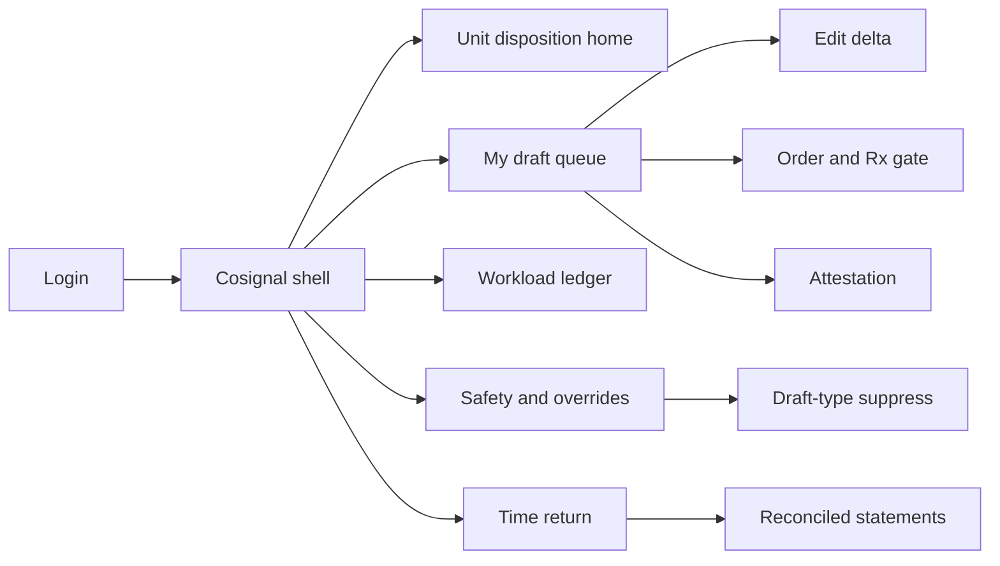
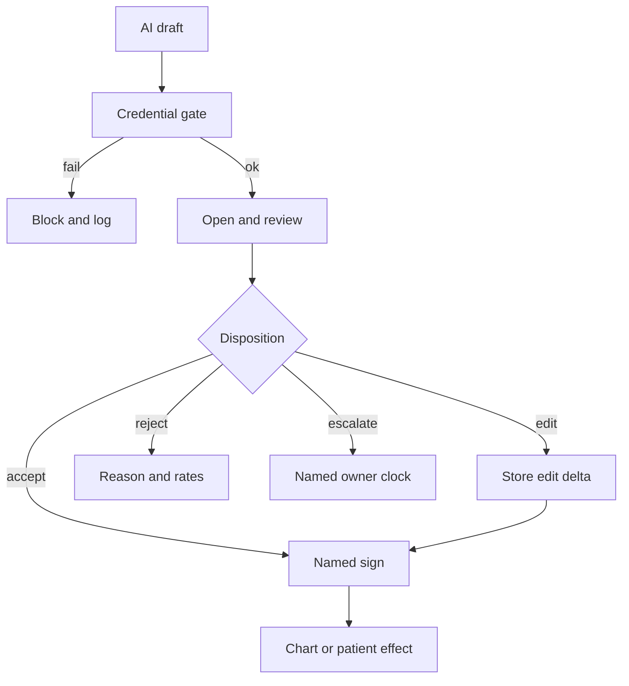

# Cosignal — Web app

**Product:** [PRODUCT.md](./PRODUCT.md)
**Primary surface:** Clinical draft disposition console (unit + role workload shell)
**Secondary surfaces:** Attestation evidence viewer (compliance/billing); payroll-reconciled time-return statements (finance)
**Design thesis:** Cosignal is a disposition desk for machine-produced clinical artefacts — the edit is the product, not another ambient-scribe cockpit and not a staffing board. The metaphor is a signed delta ledger: every note, order, dose finding, triage disposition, or inbox reply arrives as a draft that must be accepted, edited, rejected, or escalated by a named licensed person, with the before/after claim preserved. Visual language is chart-ink charcoal and disposition-teal on cool bay white — unread attestations feel invalid; interruption budgets feel physical. The Cosignal wordmark sits beside every time-return figure so finance knows minutes are payroll-confirmed, not vendor dashboard folklore.

## UX research synthesis

### Category peers (best-in-class)

- **Epic In Basket / Haiku message actions:** Dense clinical queues with role-scoped actions and escalate. Steal: disposition-first rows and ageing visibility; reject burying AI drafts in undifferentiated message noise without edit deltas.
- **Abridge / Nuance DAX clinician review UIs:** Draft note review before sign. Steal: forced open-and-review signal before attestation; reject “one-tap sign all” as a time-savings path.
- **BD Alaris / dose-error reduction workflows:** Warning → acknowledge/override with reason. Steal: override rates as governed thresholds with auto-suppress; reject alert fatigue dashboards that never stop the firehose.
- **UKG / Kronos payroll timekeeping (clinical labour truth):** Role-minute truth outside the AI tool. Steal: reconcile claimed minutes to schedule/payroll before reporting; reject vendor-only stopwatch claims.

### Patterns to adopt / reject

- **Adopt:** Named disposition required before chart/patient effect; never auto-release orders/Rx; edit delta at claim level; review-proof for attestation; interruption budget per clinician-hour; role transfer netting; unsafe reject → review with owner/deadline.
- **Reject:** Unsigned auto-file; time savings without payroll; purple “AI productivity” tiles; hiding nurse load when physician minutes are credited; chatbot as the disposition UI.

### Trust, density, and workflow constraints from PRODUCT.md

Licence/credential gate every disposition (BR-1). Orders never auto-release (BR-2). Edit is safety + discoverability + training corpus (BR-3, BR-11). Attestation requires actual review (BR-4). Override thresholds suppress draft types (BR-5). Interruption budgets defer/batch/reroute (BR-6). Time return reconciles and nets role transfers (BR-7, BR-8). Ageing queues are safety incidents (BR-10). Device-classified functions assemble surveillance without a second process (BR-12).

## Information architecture

### Nav model

### Roles → default home

| Role | Default home | Why |
|------|--------------|-----|
| Attending / APP | My draft queue | Named dispositions (BR-1) |
| Nurse / MA | Inbox draft queue + transfer view | Catch overflow without silent dump (BR-8) |
| Pharmacist | Medication/order safety queue | Dose findings and Rx gate (BR-2) |
| Unit charge / CMIO ops | Unit disposition home | Thresholds and ageing (BR-5, BR-10) |
| Patient safety | Unsafe rejection reviews | BR-9, BR-12 |
| Finance / workforce | Time-return statements | Payroll reconcile (BR-7) |

### Cross-links to OpenAPI resources

| Nav area | OpenAPI tags / resources |
|----------|---------------------------|
| Roster, credentials, supervision | Care Team |
| Draft queue states and ageing | Draft Queue |
| Accept/edit/reject/escalate | Dispositions |
| Licence and co-sign rules | Co-signature Policy |
| Order/Rx release blocks | Medication and Order Safety |
| Review-proof attestations | Documentation Attestation |
| Interruption budgets, role transfers, time return | Workload Ledger |
| Unsafe patterns, device surveillance | Safety Surveillance |

## Screen inventory

### Unit disposition home

- **Purpose:** Answer “which draft types are drowning this unit, and which are suppressed?”
- **Entry:** Charge nurse / informatics default.
- **Layout regions:** Brand + unit switcher; queue depth by draft type; override rate vs threshold; ageing > bound; interruption budget burn.
- **Primary actions:** Open suppress review; jump to ageing incident; open workload.
- **Empty / loading / error:** Healthy empty with last ingest time; feed lag = provisional.
- **BR / story ties:** BR-5, BR-6, BR-10.

### My draft queue

- **Purpose:** Role-scoped drafts awaiting disposition within interruption budget.
- **Entry:** Clinician default.
- **Layout regions:** Prioritised list (type, age, patient context minimum-necessary); budget meter; deferred/batched shelf; escalate control.
- **Primary actions:** Open draft; dispose; defer within policy; unsafe reject.
- **Empty / loading / error:** Empty = budget remaining message; over-budget drafts shown as deferred not deleted.
- **BR / story ties:** BR-1, BR-6; clinician stories.

### Edit delta viewer

- **Purpose:** Capture and retrieve what changed between draft and final at claim/instruction level.
- **Entry:** From disposition edit path; audit search.
- **Layout regions:** Side-by-side or inline diff; claim-level anchors; reason codes; train-the-model disclosure notice.
- **Primary actions:** Sign disposition; flag unsafe; export for discovery.
- **Empty / loading / error:** Accept-without-open blocked for attestation-eligible notes (BR-4).
- **BR / story ties:** BR-3, BR-4, BR-11.

### Order and prescription gate

- **Purpose:** Block auto-release; require authorised prescriber signature.
- **Entry:** Draft type medication/diagnostic order.
- **Layout regions:** Draft order; credential check; co-sign path; exception log for release attempts.
- **Primary actions:** Sign; reject; escalate to covering prescriber.
- **Empty / loading / error:** Unauthorized release attempt = recorded exception, no chart write.
- **BR / story ties:** BR-2.

### Documentation attestation

- **Purpose:** Truthful attestation: opened/reviewed proof gates billing/quality claims.
- **Entry:** Before sign-out of note drafts.
- **Layout regions:** Review telemetry (opened, dwell, sections seen); attestation statement; blocked if unread.
- **Primary actions:** Complete review; attest; cannot attest unread content.
- **Empty / loading / error:** Partial review = partial content eligible only as configured.
- **BR / story ties:** BR-4.

### Workload ledger

- **Purpose:** Interruption budgets and role-to-role transfer visibility.
- **Entry:** Unit home; workforce.
- **Layout regions:** Per clinician-hour budget; deferred counts; transfer edges (MD ← nurse etc.); net minutes.
- **Primary actions:** Adjust budget policy; reroute draft types; open transfer detail.
- **Empty / loading / error:** Missing schedule feed = budgets provisional.
- **BR / story ties:** BR-6, BR-8.

### Time-return statements

- **Purpose:** Minutes by role reconciled to payroll/scheduling before any external claim.
- **Entry:** Finance default.
- **Layout regions:** Gross claimed vs reconciled; converted to care / reduced after-hours / nothing; dual sign-off.
- **Primary actions:** Sign statement; export; reject unreconciled vendor claims.
- **Empty / loading / error:** Honest zero allowed; unreconciled cannot report.
- **BR / story ties:** BR-7.

### Override and suppress console

- **Purpose:** Govern rejection/override rates; auto-suppress breaching draft types.
- **Entry:** Safety / unit ops.
- **Layout regions:** Rate charts per type/unit; threshold; suppress state; review queue to restore.
- **Primary actions:** Confirm suppress; retune; notify model owner.
- **Empty / loading / error:** Suppressed types show patient-safe alternative path.
- **BR / story ties:** BR-5.

### Unsafe rejection and ageing incidents

- **Purpose:** One-step unsafe reject with reason; ageing queues as safety incidents; device surveillance pack.
- **Entry:** From queue; safety home.
- **Layout regions:** Pattern detection; owner/deadline; link to patient-safety system; device reporting assembly.
- **Primary actions:** Assign review; escalate; export surveillance record.
- **Empty / loading / error:** Empty patterns still show cadence of review.
- **BR / story ties:** BR-9, BR-10, BR-12.

## Key flows

1. **Dispose a draft** — draft arrives → credential check → open/review → accept/edit/reject/escalate → delta stored → chart effect only after disposition; failure: no credential or unread note attestation blocked.

2. **Order release attempt without prescriber** — block → exception record → route to authorised signer.

3. **Interruption budget breach** — next drafts defer/batch/reroute → clinician sees shelf not silent drop.

4. **Override threshold suppress** — rate breach → auto-suppress draft type → review with owner → restore or retune.

5. **Time-return close** — dispositions → role minutes → net transfers → payroll reconcile → finance attest.

## Design system

### Tokens (CSS variables)

- `--color-ink: #1B222A` — primary text
- `--color-bay: #F3F6F8` — app ground
- `--color-panel: #FFFFFF`
- `--color-chart: #3D4F5F` — secondary / chrome
- `--color-dispose: #0E7C66` — accepted / signed
- `--color-edit-amber: #B8791A` — edited delta / deferred
- `--color-reject: #B33C32` — reject / unsafe / ageing incident
- `--color-budget: #2F5D8A` — interruption budget meter
- `--color-brand: #1E3A45` — Cosignal wordmark
- `--font-display: "IBM Plex Serif", serif` — time-return numerals
- `--font-body: "IBM Plex Sans", sans-serif`
- `--font-mono: "IBM Plex Mono", monospace` — draft ids, claim anchors
- `--space-1`…`--space-8`: 4px scale
- `--radius-sm: 4px`; `--radius-md: 6px`
- `--motion-sign: 160ms ease-out` — disposition confirm
- `--motion-budget: 220ms linear` — budget burn
- `--motion-age: 200ms ease-in-out` — ageing pulse
- Atmosphere: faint EHR-grid hairlines; no ambient-scribe marketing photography.

### Typography & brand

- Display for reconciled minutes; body for queues; mono for deltas and ids.
- Brand on unit home and every finance statement.
- Login: brand-first; headline (“The edit is the record”); one CTA.

### Do / don’t

- **Do:** Require named disposition; show deltas; net role transfers; suppress noisy draft types; payroll-gate time claims.
- **Don’t:** Auto-release orders; sign-without-open; purple productivity glow; double-count physician and nurse minutes.

### Accessibility & domain trust cues

- AA+; ageing/unsafe not colour-only.
- Live regions for ageing incidents and suppress events.
- Focus order: draft → diff → disposition controls.
- Minimum-necessary patient fields in queues.

## Component patterns

- **DraftQueueRow** — type, age, budget cost, credential-ok.
- **EditDeltaPane** — claim-level before/after.
- **AttestationProof** — opened/reviewed gates sign.
- **OrderReleaseLock** — blocks non-prescriber release.
- **InterruptionBudgetMeter** — per clinician-hour.
- **RoleTransferEdge** — minutes moved between roles.
- **OverrideThresholdBar** — rate vs suppress line.
- **UnsafeRejectControl** — one-step with reason + review routing.

## Out of scope for v1 web

- Training ambient models; full EHR editor replacement; nurse call systems; payroll HRIS replacement; patient-facing apps; multi-vendor MLOps feature store UI.
